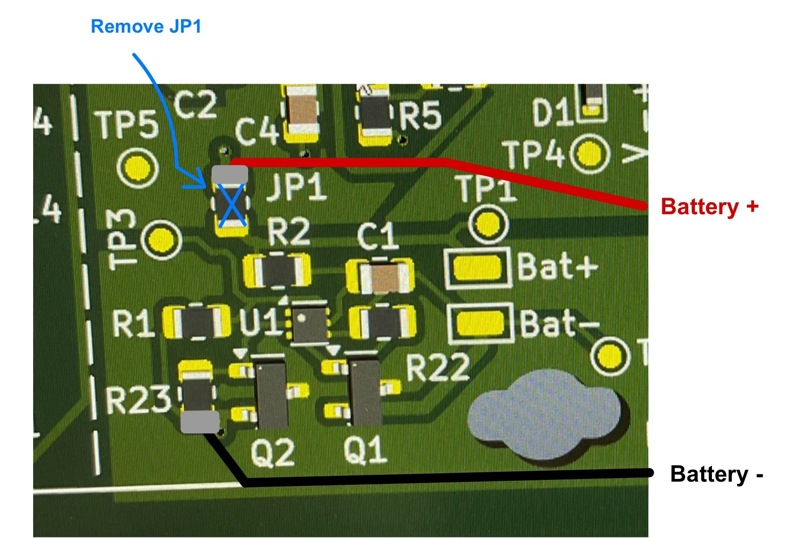
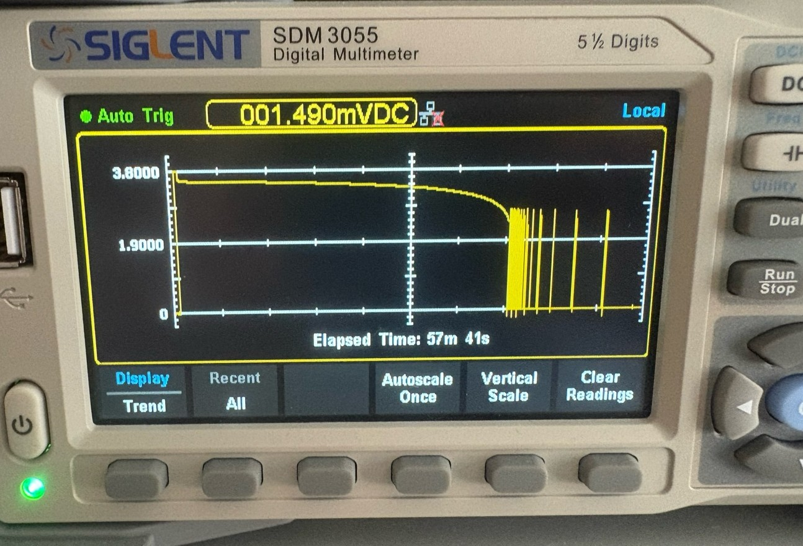

# Hotfix documentation:

I just found out that there is a small flaw in the hardware design of the device.
The battery I recommend for the device (JBL Clip 2 replacement battery) has a battery protection already implemented (see picture below). This can lead to the following problem: When the battery cell voltage drops below a certain treshold of 2.5V the internal battery protection disconnects the output terminal with a mosfet. The battery protection on the PCB misinterprets this as a deeply depleted battery and therefore refuses to charge the battery. In this situation the 2 battery protections deadlock each other. 

To fix this, make the following changes to the PCB:

1) Disconnect JP1
2) Connect the positive battery terminal (red) to Pin 1 of JP1
3) Connect the negative battery terminal (black) directly to GND on one of the pads

With these changes the battery protection on the PCB gets bypassed, as it is not necessary and can cause the problem mentioned above.

Before you attempt this workaround make sure that your battery has a battery protection integrated (experimental or through a datasheet)! Do not operate a battery without any battery protection!

The UVP integrated into the battery shuts off at ~2.5V. Test performed with discharge current of 600mA.
The cell voltage recovers when the load is disconnected, when the load gets reconnected
the cell voltage drops down again, this is why the output voltage 'oscillates' slowly at first. This
eventually stops as the cell voltage goes down further.

